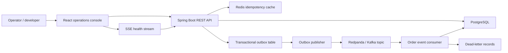
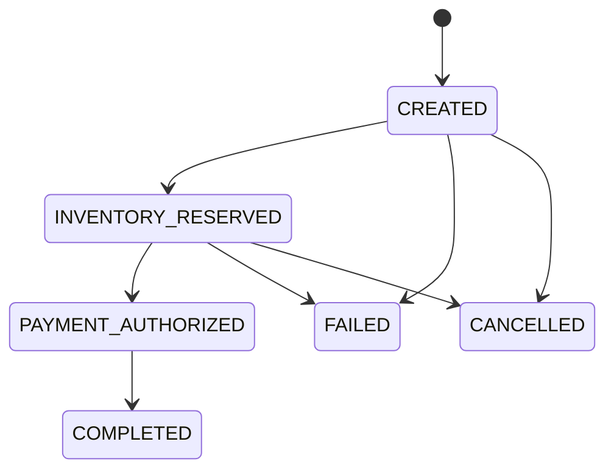
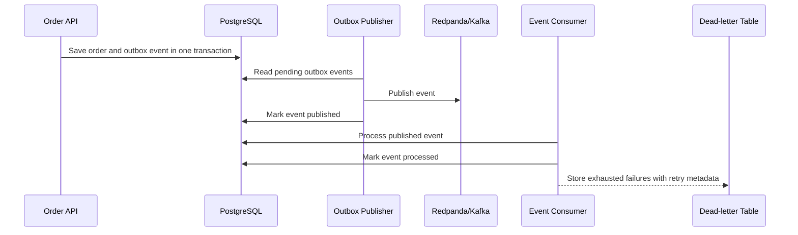

# OrderFlow Architecture

OrderFlow is a containerized order workflow system with a Spring Boot backend, PostgreSQL persistence, Redis idempotency cache, Redpanda/Kafka-compatible event broker, and React TypeScript operations console.

## Runtime View

The backend is organized with modular service boundaries rather than separate physical services. Order, inventory, payment simulation, audit, outbox, event processing, DLQ, operations health, and realtime endpoints each have their own package and persistence boundary.

## Order State Flow

The state machine keeps workflow transitions explicit. Audit log entries make each state change visible to the order timeline and operations console.

## Outbox And Recovery Flow

Failures are intentionally visible. Publish and consumer failures record retry count, next attempt time, and last error. Exhausted failures are moved to dead-letter records and can be retried through the manual retry API or the operations console.

## Baseline And Improved Modes

Benchmark modes are kept only for evaluation:

- `baseline` correctness mode uses naive repeated-submit and inventory behavior.
- `improved` correctness mode uses strict idempotency and optimistic locking.
- `direct` async mode runs the workflow synchronously.
- `outbox-kafka` async mode uses transactional outbox, event publishing, retry metadata, DLQ, and manual retry.

The default local runtime uses the improved path.

Benchmark report generation uses the recording broker for deterministic CI-friendly evidence. Docker Compose remains the local runtime path for Redpanda/Kafka-backed event publishing.
